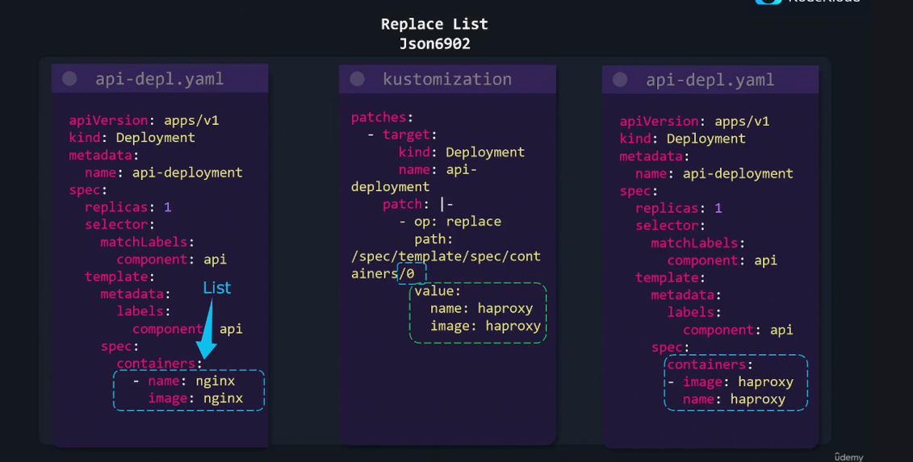

# Kustomize
---

#CKAD #Certification2025 #K8s 
## Problem its trying to address :  
- Duplication of configs across all environments, even when there is a single parameter changing, one need to maintain the entire config file for each environment.  
- Maintaining separate environment directories with duplicated configs is functional, but not optimal or scalable.
- Manual copying and updating process is ****tedious****, ****error-prone****, and ****not scalable**** as the number of resources and environments grows.
- Maintaining separate environment directories with duplicated configs becomes harder to manage as the number of resources grows.
### Solution 
- Kustomize introduces the concepts of ****base**** and ****overlays**** to manage Kubernetes configurations across different environments.
- ****Base Config:**** :  Represents the Kubernetes configurations that are __identical__ across all environments (dev, stg, prod, etc.).
- **Overlays** allow customization on a per-environment basis.
- An overlay can be created for each environment (dev, stg, prod).
- Overlays specify properties or parameters to override from the base config.
- Overlays are designed to add or modify the base configurations for specific environments.

#### Helm : Alternative to Kustomize 
* Helm use go Template , bit more powerful then Kustomize 
* Helm is a package manager 

### Installation - 

* Shipped with default kubectl 
* here is how to install kustomize 

```bash
curl -s "https://raw.githubusercontent.com/kubernetes-sigs/kustomize/master/hack/install_kustomize.sh"  | bash
```
### Validation 

```bash
$ kustomize version --short 
```

#### Apply

```bash  
kustomize build [root-folder-name]/ | kubectl apply -f 
```

#### Delete 

```bash
kustomize build [root-folder-name]/ | kubectl delete -f 
```

##### How to manage recourses' stored under different folders ?


### Transformers 

#### Common Transformers 

* Common Configuration , common annotation , **Common labels** to be added to the Kubernetes resources. 
* Apply to the configuration within its folder.
#### Image Transformer 
* Name of the resource 
* Name 
* Name Prefix 
* Name Suffix 


```yaml
..
...
...
resources:  
- deployment.yaml  
  
images:  
- name: nginx  
  newName: myregistry/nginx  
  newTag: "1.19.0"

```


#### Patch

* Kustomize patch provide a way to modify Kubernetes config.
* Unlike common transformation, patches provide a more "surgical" approach to targeting one or more specific sections in Kubernetes resources. 
* To create a patch we need 3 parameters 
	* Operation Type : add/remove/replace
	* Target :  What resource the patch is getting applied to
		* Kind 
		* Version/Group 
		* Name 
		* NameSpace 
		* labelSelector 
		* AnnoationSelector 
	* Value : What is the value it would be either replace or add (this is needed only for add and replace operation type).


**Inline patch (JSON 6902 patch)**



Index starts from '0' (zero)

#### Overlays


* Overlays in Kustomize are used to customize Kubernetes configurations for different environments—such as development, staging, and production—by layering environment-specific adjustments on top of a shared base configuration.
* The project directory structure consists of a base folder with shared or default Kubernetes manifest files, and separate overlay folders for each environment where targeted modifications are applied.


* Each overlay folder contains its own `kustomization.yaml` file that references the base via a relative path and specifies patches or environment-specific resources.
	

- Overlays use patches (either in-line or as files) to modify or override properties from the base, such as changing replica counts or adjusting resource requests, tailored for the environment.
	
- Overlay folders can also include entirely new resource files that are only required for a specific environment (e.g., adding a deployment for Grafana only in production).
- The inclusion of resources in overlay `kustomization.yaml` files uses a `resources` section, so overlays can both modify existing and introduce new resources as needed.


- Kustomize allows flexible directory layouts, so both base and overlay folders can be further subdivided by feature or organizational preference, as long as resource import paths are correctly specified in each relevant `kustomization.yaml` file.
- The concept centers on separation of concerns: bases encapsulate common configuration, overlays encapsulate environmental or situational differences via targeted modifications and additions.

#### Components 

When we need to add a premium feature in few of the environments, but not all of the environments then, we can leverage the component feature of the Kustomize. 

- Kustomize components provide a way to define reusable configuration logic blocks that can be flexibly included in multiple overlays, making them ideal for enabling optional features in select environments without copying configuration.
	
- Components group all Kubernetes resources, patches, ConfigMaps, Secrets, and related files for a particular feature (e.g., caching, external database) into a single folder and kustomization.yaml file, ensuring easy updates and maintenance.
- The API version and kind for a component kustomization.yaml file are distinct: you must set it to the required component kind and version according to Kustomize standards.
	
* In overlays where a feature is needed, you simply import the desired component in that overlay’s kustomization.yaml file using the components section and path reference.
    
* This approach avoids duplication, reduces risk of configuration drift, and keeps settings for each optional feature centralized—changes or fixes only need to be made once in the relevant component folder.

* Each overlay references both the shared base and the specific components it requires, allowing tailored combinations for each deployment environment, while the base continues to hold global configurations.
* Components streamline configuration management in environments where certain features should only be active in some overlays, while facilitating scaling and feature additions for evolving applications.